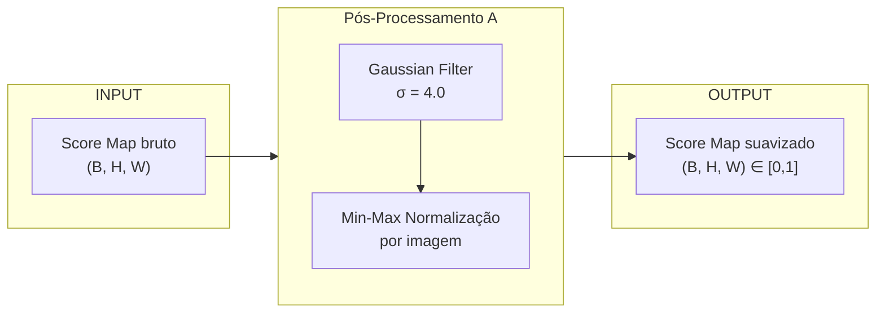
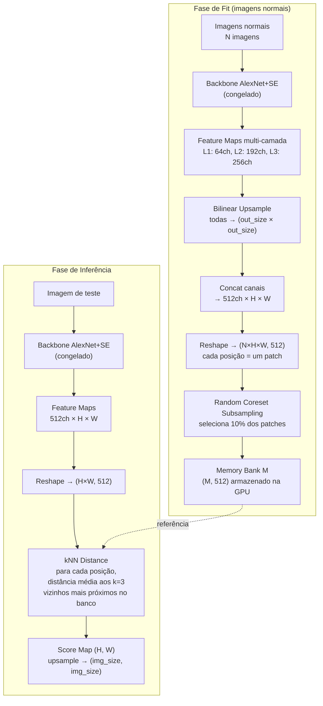
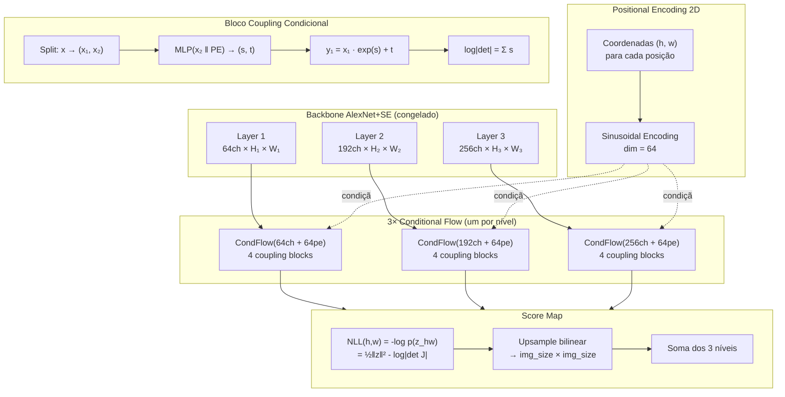
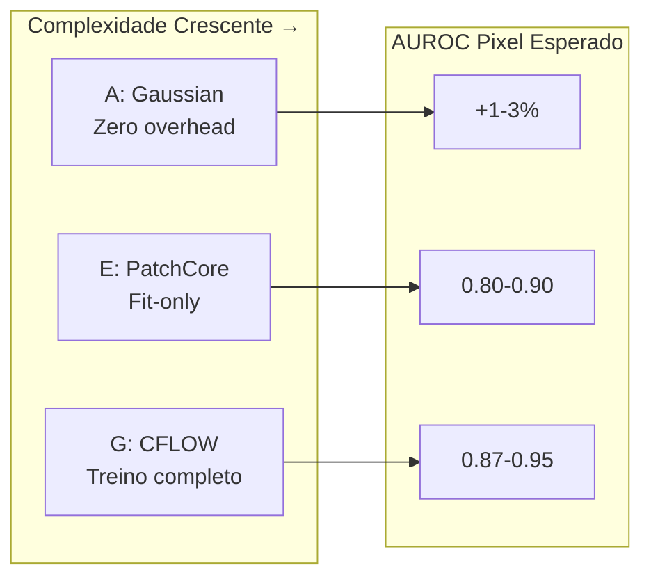
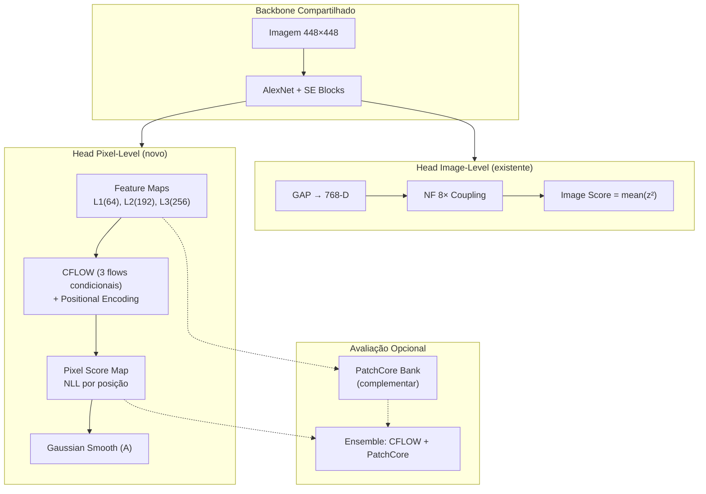

# Implementação das Opções A, E e G para Localização Pixel no SEDifferNet

## Visão Geral

Este documento descreve três abordagens complementares para obter mapas de anomalia a nível de pixel, partindo do SEDifferNet existente:

| Opção | Nome | Tipo | Treino necessário | AUROC esperado |
|---|---|---|---|---|
| **A** | Gaussian Smoothing + Min-Max | Pós-processamento | Não | +0.01–0.03 sobre raw |
| **E** | PatchCore (Memory Bank + kNN) | Feature matching | Não (só fit) | 0.80–0.90 |
| **G** | CFLOW-AD (Conditional NF + PE) | Normalizing Flow espacial | Sim | 0.87–0.95 |

---

## Opção A — Gaussian Smoothing + Min-Max por Escala

### Arquitetura

Não é um modelo — é uma camada de pós-processamento aplicada sobre qualquer mapa de anomalia bruto.



### Implementação

```python
from scipy.ndimage import gaussian_filter
import numpy as np

def gaussian_smooth(score_map, sigma=4.0):
    """Suaviza mapa de anomalia com filtro Gaussiano.
    
    Args:
        score_map: numpy array (B, H, W) — mapa bruto de scores
        sigma: desvio padrão do kernel Gaussiano
    Returns:
        numpy array (B, H, W) suavizado
    """
    out = np.empty_like(score_map)
    for b in range(score_map.shape[0]):
        out[b] = gaussian_filter(score_map[b], sigma=sigma)
    return out

def minmax_norm(arr, eps=1e-8):
    """Normalização min-max por imagem."""
    flat = arr.reshape(arr.shape[0], -1)
    mn = flat.min(axis=1, keepdims=True)
    mx = flat.max(axis=1, keepdims=True)
    return ((flat - mn) / (mx - mn + eps)).reshape(arr.shape)
```

### Características

| Aspecto | Detalhe |
|---|---|
| **Complexidade** | O(H×W) por imagem — trivial |
| **Parâmetros** | Apenas σ (sigma) — tipicamente 2.0–6.0 |
| **Efeito** | Remove ruído de alta frequência; conecta regiões próximas de anomalia |
| **Limitação** | Não gera informação nova — apenas suaviza o que já existe |
| **Quando usar** | Sempre, como etapa final de qualquer método pixel |

### Impacto no SEDifferNet

- **Aplicável diretamente** sobre `get_se_anomaly_maps()` sem alteração do modelo
- Melhora a consistência espacial das regiões anômalas
- Ganho típico: +1–3% AUROC pixel
- Pode-se fazer busca de hiperparâmetro sobre σ ∈ {2, 3, 4, 5, 6}

---

## Opção E — PatchCore (Memory Bank + kNN)

### Arquitetura



### Implementação

```python
class PatchCore:
    """Memory bank de features normais + distância kNN por posição espacial."""

    def __init__(self, img_size=448, out_size=56, coreset_ratio=0.1, k=3):
        self.backbone = MultiLayerAlexNet(out_size=out_size)  # Congelado
        self.bank = None  # (M, C) — memory bank

    def fit(self, train_loader):
        """Extrai features de todas posições espaciais das imagens normais."""
        feats_all = []
        for batch in train_loader:
            concat, _ = self.backbone(batch)  # (B, 512, H, W)
            B, C, H, W = concat.shape
            f = concat.permute(0, 2, 3, 1).reshape(-1, C)  # (B*H*W, C)
            feats_all.append(f)
        
        feats = torch.cat(feats_all, dim=0)  # (N*H*W, C)
        
        # Coreset subsampling (reduz tamanho mantendo cobertura)
        n_select = int(len(feats) * self.coreset_ratio)
        idx = random_choice(len(feats), n_select)
        self.bank = feats[idx]  # (M, C) onde M << N*H*W

    def score(self, x):
        """Para cada posição (h,w): distância média aos k vizinhos mais próximos."""
        concat, _ = self.backbone(x)  # (B, C, H, W)
        B, C, H, W = concat.shape
        f = concat.permute(0, 2, 3, 1).reshape(B * H * W, C)
        
        # Busca kNN chunked para caber na GPU
        dists = torch.cdist(f, self.bank)      # (B*H*W, M)
        topk = torch.topk(dists, k=3, largest=False).values  # (B*H*W, 3)
        score = topk.mean(dim=1).view(B, H, W)
        
        # Upsample para resolução original
        return F.interpolate(score, size=img_size, mode='bilinear')
```

### Características

| Aspecto | Detalhe |
|---|---|
| **Complexidade fit** | O(N × H × W) — apenas extrai e armazena |
| **Complexidade inferência** | O(H×W × M) por imagem — dominado por cdist |
| **Memória** | Bank de ~5k–50k vetores de 512-D (~100MB) |
| **Parâmetros treináveis** | Zero — backbone congelado |
| **Hiperparâmetros** | `coreset_ratio` (0.01–0.25), `k` (1–9), `out_size` |
| **Vantagem** | Simples, robusto, sem treino, SOTA em muitos benchmarks |
| **Limitação** | Custo de memória/inferência escala com tamanho do banco |

### Impacto no SEDifferNet

- **Usa as mesmas features do SE backbone** — os blocos SE recalibram canais, melhorando a qualidade dos patches
- **Não precisa de treino adicional** — apenas passar imagens normais pela rede
- **Complementar ao image-level**: mantém NF para detecção, usa PatchCore para localização
- O coreset subsampling (10%) torna viável mesmo com centenas de imagens
- **Resultado esperado**: 0.80–0.90 pixel AUROC (muito superior aos 0.75 do SE-map)

---

## Opção G — CFLOW-AD (Conditional Normalizing Flow com Positional Encoding)

### Arquitetura



### Implementação

```python
def _pos_encoding(h, w, dim=64):
    """Positional encoding 2D sinusoidal → (H*W, dim).
    
    Codifica a posição (y, x) de cada localização espacial
    usando senos/cossenos de diferentes frequências.
    Isso dá ao flow consciência posicional.
    """
    d_quarter = dim // 4
    y_pos = torch.arange(h).float()
    x_pos = torch.arange(w).float()
    div = torch.exp(torch.arange(0, d_quarter) * (-log(10000) / d_quarter))
    
    pe_y = [sin(y·div), cos(y·div)]  # (h, dim/2)
    pe_x = [sin(x·div), cos(x·div)]  # (w, dim/2)
    
    # Broadcast e concatenar → (h*w, dim)
    return cat([pe_y.expand(h,w,dim/2), pe_x.expand(h,w,dim/2)], dim=-1)


class _CondCouplingBlock(nn.Module):
    """Affine coupling condicional: recebe feature + positional encoding."""
    
    def __init__(self, channels, cond_dim, hidden=256):
        self.c_split = channels // 2
        c_pass = channels - self.c_split
        
        # MLP recebe: metade dos canais + encoding posicional
        self.net = nn.Sequential(
            nn.Linear(c_pass + cond_dim, hidden),
            nn.ReLU(),
            nn.Linear(hidden, hidden),
            nn.ReLU(),
            nn.Linear(hidden, 2 * self.c_split),  # prediz (s, t)
        )
        # Zero-init para começar como identidade
        nn.init.zeros_(self.net[-1].weight)
        nn.init.zeros_(self.net[-1].bias)

    def forward(self, x, cond):
        x1, x2 = x[:, :split], x[:, split:]
        st = self.net(cat([x2, cond], dim=1))
        s, t = st.chunk(2, dim=1)
        s = tanh(s) * 2.0  # clamp para estabilidade
        y1 = x1 * exp(s) + t
        log_det = s.sum(dim=1)
        return cat([y1, x2], dim=1), log_det


class CFLOW:
    """Position-conditional NF: um flow por nível de feature."""
    
    def __init__(self, out_size=56, cond_dim=64, n_blocks=4, hidden=256):
        self.backbone = MultiLayerAlexNet(out_size)  # Congelado
        # Um flow separado para cada nível semântico
        self.flows = [
            CondFlow(64, cond_dim, n_blocks, hidden),   # Nível 1
            CondFlow(192, cond_dim, n_blocks, hidden),  # Nível 2  
            CondFlow(256, cond_dim, n_blocks, hidden),  # Nível 3
        ]

    def fit(self, train_loader, epochs=50):
        """Treina flows para modelar distribuição normal por posição."""
        optimizer = Adam(all_flow_params, lr=1e-3)
        for epoch in range(epochs):
            for batch in train_loader:
                feats = backbone(batch)  # [L1, L2, L3]
                total_nll = 0
                for feat, flow in zip(feats, self.flows):
                    B, C, H, W = feat.shape
                    pe = pos_encoding(H, W)  # (H*W, cond_dim)
                    x = feat.reshape(B*H*W, C)
                    cond = pe.repeat(B, 1)
                    z, log_det = flow(x, cond)
                    nll = 0.5*(z**2).sum(1) - log_det
                    total_nll += nll.mean()
                total_nll.backward()
                optimizer.step()

    def score(self, x):
        """NLL por posição = mapa de anomalia."""
        feats = backbone(x)
        score_map = 0
        for feat, flow in zip(feats, self.flows):
            B, C, H, W = feat.shape
            pe = pos_encoding(H, W)
            z, log_det = flow(feat.reshape(B*H*W, C), pe.repeat(B,1))
            nll = (0.5*(z**2).sum(1) - log_det).view(B, H, W)
            score_map += upsample(nll, img_size)
        return score_map
```

### Características

| Aspecto | Detalhe |
|---|---|
| **Complexidade treino** | O(epochs × N × H×W × C) — moderada |
| **Complexidade inferência** | O(H×W × n_blocks × C) — rápida |
| **Parâmetros treináveis** | ~500K–2M (nos MLPs dos coupling blocks) |
| **Hiperparâmetros** | `cond_dim` (32–128), `n_blocks` (4–8), `hidden` (128–512), `lr`, `epochs` |
| **Vantagem principal** | **Consciência posicional** — aprende que diferentes regiões da imagem têm distribuições diferentes |
| **Vantagem vs FastFlow** | Não precisa de NF convolucional pesado; MLPs por posição são leves |
| **Limitação** | Precisa de treino; pode overfit com poucos dados |

### Impacto no SEDifferNet

- **Usa o mesmo backbone SE** mas extrai features **antes do GAP**
- **Consciência posicional** via PE é o diferencial vs PaDiM/PatchCore
  - PaDiM: assume independência entre posições
  - PatchCore: não modela distribuição, só distância
  - CFLOW: **modela p(feature | posição)** explicitamente
- **Treinável** — aprende padrões específicos do dataset
- O flow aprende que certas posições (ex: borda do isolador) têm features específicas → anomalias são melhor discriminadas
- **Resultado esperado**: 0.87–0.95 pixel AUROC

---

## Comparação das Três Opções



| Critério | A (Gaussian) | E (PatchCore) | G (CFLOW) |
|---|---|---|---|
| Treino | Nenhum | Nenhum (só extrai features) | 50–100 épocas |
| Parâmetros extras | 0 | 0 | ~1M |
| Inferência | <1ms | ~50ms/imagem | ~20ms/imagem |
| Memória GPU extra | 0 | ~100MB (bank) | ~50MB (flow weights) |
| Adaptabilidade ao dataset | Nenhuma | Limitada (features fixas) | Alta (flow aprende) |
| Complementar ao NF image-level | Sim | Sim | Sim |
| Requer GT de pixel para treino | Não | Não | Não |

---

## Integração no SEDifferNet Padrão

A estratégia recomendada é **dual-head**:



---

## Prompt para IA — Implementação no SEDifferNet

```
CONTEXTO:
Tenho um modelo SEDifferNet para detecção de anomalias em imagens industriais.
- Backbone: AlexNet com 4 blocos SE Attention (simsa1-4) inseridos entre camadas.
- Head Image-level: GAP → NF (8 coupling blocks, 768-D).
- Dataset: INSPLAD-seg, classe "lightning-rod-suspension", 448×448.
- Framework: PyTorch 2.5, CUDA, FrEIA para NF.
- Arquivo modelo: model.py (classe SEDifferNet).
- Arquivo treino: train.py.
- Arquivo config: config.py.

OBJETIVO:
Modificar o SEDifferNet para adicionar localização pixel-level usando a combinação de:
1. CFLOW-AD (Opção G) como head pixel principal.
2. PatchCore (Opção E) como fallback/ensemble.
3. Gaussian Smoothing (Opção A) como pós-processamento final.

ESPECIFICAÇÕES TÉCNICAS:

1. BACKBONE COMPARTILHADO:
   - Manter o AlexNet + SE blocks existentes.
   - Extrair feature maps ANTES do GAP em 3 níveis:
     * L1: após simsa1 (64 canais)
     * L2: após simsa2 (192 canais)
     * L3: após simsa4 (256 canais)
   - Todas as feature maps devem ser upsampled para um tamanho comum (out_size=56).
   - O backbone permanece congelado; apenas os SE blocks são treináveis (0.5x LR).

2. HEAD IMAGE-LEVEL (manter intacto):
   - GAP → NF → z → score = mean(z²).
   - Loss: NLL = 0.5*||z||² - log|det J|.
   - Treinar normalmente como antes.

3. HEAD PIXEL — CFLOW-AD:
   - Para cada nível L_i, criar um flow condicional:
     * Input: feature vector de C canais na posição (h,w)
     * Condição: positional encoding 2D sinusoidal de dimensão 64
     * Arquitetura: 4-8 affine coupling blocks com MLP (hidden=256)
     * Output: z_hw, log_det
   - Score map: NLL(h,w) = 0.5*||z_hw||² - log_det_hw
   - Somar NLL maps dos 3 níveis (upsampled para img_size).
   - Treinar junto com NF usando loss combinada ou separadamente após NF convergir.
   - Learning rate: 1e-3 (separado do NF principal).

4. HEAD PIXEL — PATCHCORE (complementar):
   - Após treino, coletar features de todas posições do train set.
   - Coreset subsampling: 10% das features.
   - Inferência: distância kNN (k=3) ao memory bank por posição.
   - Pode ser usado como ensemble com CFLOW ou como fallback.

5. PÓS-PROCESSAMENTO (Opção A):
   - Aplicar gaussian_filter(score_map, sigma=4) em todo mapa pixel.
   - Normalização min-max por imagem.

6. LOOP DE TREINO:
   - Fase 1 (épocas 1-30): Treinar apenas NF + SE blocks (image-level).
   - Fase 2 (épocas 31-100): Treinar CFLOW head + fine-tune SE (pixel-level).
   - Alternativa: treinar tudo simultaneamente com loss ponderada.
   - Loss total = λ_img * NLL_image + λ_pix * NLL_pixel (λ_img=1.0, λ_pix=0.1).
   - Avaliar a cada 5 épocas:
     * Image AUROC: score image-level.
     * Pixel AUROC: score CFLOW + Gaussian smooth vs ground truth masks.
   - Salvar best model por IMAGE AUROC e best model por PIXEL AUROC separadamente.

7. AVALIAÇÃO:
   - Pixel score final = ensemble(CFLOW_score, PatchCore_score) com pesos otimizáveis.
   - Métricas: AUROC pixel, AUROC image, AUPRO (opcional).
   - Ground truth: máscaras binárias em ground_truth/{class_name}/ com sufixo _mask.

8. CONFIGURAÇÃO (config.py):
   - Adicionar: cflow_cond_dim=64, cflow_n_blocks=4, cflow_hidden=256,
     cflow_lr=1e-3, patchcore_coreset=0.1, patchcore_k=3,
     pixel_eval_interval=5, gaussian_sigma=4.0,
     pixel_lambda=0.1, pixel_start_epoch=30.

RESTRIÇÕES:
- NÃO alterar a interface do forward() do SEDifferNet para image-level.
- NÃO remover o GAP — ele é necessário para o NF existente.
- O CFLOW head opera sobre feature maps EXTRAÍDAS por hooks ou return_features=True.
- Manter compatibilidade com checkpoints existentes.
- Safe torch save (temp file + replace) para evitar corrupção.
- Mixed precision (GradScaler + autocast) para eficiência.
- Suportar resume training (carregar estado do CFLOW + NF).

RESULTADO ESPERADO:
- Image-level AUROC: manter ~0.95+ (não prejudicar com mudanças pixel).
- Pixel-level AUROC: atingir 0.85–0.95 (vs 0.75 atual com SE-maps).
- Modelo salva best checkpoint para cada métrica separadamente.
- Saída inclui mapa de calor visualizável por imagem de teste.
```

---

## Notas de Implementação

### Ordem de prioridade para implementação gradual:

1. **Primeiro**: Adicionar `return_features=True` no forward e extrair features multi-camada (já existe no modelo atual).
2. **Segundo**: Implementar PatchCore como avaliação pós-treino (sem alterar treino).
3. **Terceiro**: Implementar CFLOW head e integrá-lo no loop de treino.
4. **Quarto**: Combinar CFLOW + PatchCore + Gaussian em pipeline de inferência.

### Riscos e mitigações:

| Risco | Mitigação |
|---|---|
| CFLOW overfit com poucos dados (117 normais) | Early stopping + dropout nos MLPs |
| Loss pixel interfere no image-level | Fase 1 sem pixel; ou λ_pix pequeno |
| OOM com out_size=56 e 3 flows | Reduzir hidden ou out_size; usar fp16 |
| PatchCore memory bank grande | Coreset 1-5%; ou reduzir out_size |
