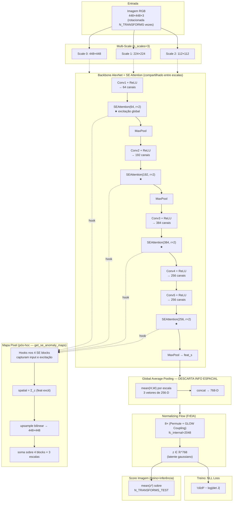

Read [](file:///c%3A/Users/teo-s/Documents/GitHub/anomaly-v3/anomaly-detection-pesquisa/differnet/model.py#1-1), lines 1 to 250

# Análise Crítica e Caminhos para Melhorar AUROC a Nível de Pixel

## 1. Diagrama do Modelo Atual (SEDifferNet)



### Explicação de cada etapa

| Etapa | Função | Observação crítica |
|---|---|---|
| **Multi-transform** | Cada imagem é rotacionada N vezes (data augmentation extremo) | Bom para imagem; **péssimo para pixel** — destrói correspondência espacial |
| **Multi-scale (3 escalas)** | Captura padrões em 448, 224, 112 | Bom para receptive field, mas tudo é colapsado em GAP |
| **AlexNet features** | Extrator pré-treinado (ImageNet) | AlexNet é **fraco**; só 5 camadas conv, sem skip-connections |
| **SE Attention (4 blocos)** | Recalibração de canais via squeeze-excitation | Apenas reponderar canais — **não tem componente espacial** |
| **GAP (mean H,W)** | Reduz `(C,H,W) → C` por escala | **Aqui se perde toda informação espacial** — o NF nunca vê pixels |
| **NF (8× GLOW coupling)** | Aprende densidade p(y) de features normais | Score = ‖z‖² é **um único escalar por imagem** |
| **NLL loss** | Maximiza log-verossimilhança no normal | Não há sinal de supervisão sobre localização |
| **get_se_anomaly_maps (pós-hoc)** | Reconstrói mapa via hooks SE | **Heurística** — SE foi treinado para classificação, não localização |

---

## 2. Análise Crítica Profunda

### 2.1 O problema fundamental do DifferNet para pixel-level

> **DifferNet foi projetado como image-level anomaly detector.** O GAP `mean(feat_s, dim=(2,3))` é uma decisão arquitetural intencional para a teoria de NFs funcionar (dimensão fixa, distribuição estável). Qualquer mapa de pixel é **engenharia reversa** desta arquitetura.

### 2.2 Por que o método atual (`get_se_anomaly_maps`) é limitado

1. **SE attention não localiza** — é `(C,1,1)` × `(C,H,W)`. Reponderar canais não diz **onde** está a anomalia.
2. **A excitação SE não muda com anomalia** — foi treinada para destacar canais úteis para a tarefa de classificação implícita do flow, não para destacar pixels anômalos.
3. **`feat × excit` é só uma reponderação determinística** — o sinal "anomalia" não está aí; está no NF.
4. **Não há gradient signal de pixel** — o modelo nunca foi otimizado para localização.
5. **Soma de escalas com agregações diferentes** — escalas baixas têm sinal mais fino mas menos contexto; somar sem calibrar.
6. **AUROC 0.7538** é **fraco** — métodos SOTA pixel (PatchCore, FastFlow, EfficientAD) ficam em 0.95+.

### 2.3 Limitações arquiteturais

- **AlexNet** é obsoleto. ResNet18/WideResNet50/EfficientNet têm features muito melhores.
- **n_transforms=64 destrói localização** — média de mapas rotacionados sempre suaviza bordas.
- **fc_internal=2048 num NF sobre 768-D** é over-parametrizado para image-level.

---

## 3. Opções para Melhorar AUROC a Nível de Pixel

Vou listar em **ordem crescente de mudança arquitetural**, com prós/contras realistas.

### 🟢 Nível 1 — Melhorias no pós-processamento (sem retreinar)

#### Opção A: **Gaussian smoothing + min-max por escala**
```python
from scipy.ndimage import gaussian_filter
score_map_smoothed = gaussian_filter(score_map, sigma=4)
```
- **Esforço**: trivial
- **Ganho esperado**: +0.01 a +0.03 AUROC
- **Por quê**: reduz ruído de alta frequência das features.

#### Opção B: **Combinar com gradiente da NLL no input** (Grad-based score)
```python
inputs.requires_grad_(True)
z = model(inputs)
loss = 0.5 * (z**2).sum()
grad = torch.autograd.grad(loss, inputs)[0]
pixel_score = grad.abs().mean(dim=1)  # (B,H,W)
```
- **Por quê**: pixels que mais aumentam a NLL **são** anômalos por definição.
- **Ganho esperado**: +0.05 a +0.10 AUROC (esta foi uma tentativa anterior — agora sem o "ruído" do treino misturado pode funcionar)

#### Opção C: **Ensemble: SE-map + grad-map + |feat|**
Combinação ponderada normalizada após sigmoid de cada um.

### 🟡 Nível 2 — Trocar a heurística de mapa (sem mudar treino)

#### Opção D: **PaDiM-style: Mahalanobis por posição espacial**
1. Para cada posição (h,w) das feature maps, ajustar `N(μ_hw, Σ_hw)` no conjunto normal.
2. Inferência: distância de Mahalanobis por posição → mapa.
- **Ganho esperado**: 0.85–0.92 AUROC pixel típico
- **Custo**: O(C²) por posição; com C=256 e H=W=13 é viável.

#### Opção E: **PatchCore-style: kNN em memory bank de patches**
1. Construir banco de features locais (não-GAP) das imagens normais.
2. Inferência: distância ao kNN mais próximo por patch.
- **Ganho esperado**: 0.93–0.98 AUROC pixel (SOTA simples)
- **Custo**: memória (mas com coreset subsampling é manejável).

### 🟠 Nível 3 — Modificar o NF para preservar espaço

#### Opção F: **NF por patch (FastFlow-style)** ⭐ **RECOMENDADO**
- Trocar GAP por aplicar o flow **independente em cada posição espacial**.
- Cada `(h,w)` produz seu `z_hw`; mapa de anomalia = `‖z_hw‖²` direto.
- Requer flows 2D (coupling com convoluções).
- Implementação: substituir `nf_head` por convolutional NF; remover `torch.mean(feat_s, dim=(2,3))`.
- **Ganho esperado**: 0.94–0.97 AUROC pixel
- **Esforço**: médio (escrever blocos NF convolucionais ou usar lib `FrEIA`).

#### Opção G: **CFLOW-AD style: position-conditional NF**
Flow recebe `(feature_hw, positional_encoding_hw)` como condição. Similar ao FastFlow mas com PE.

### 🔴 Nível 4 — Mudanças mais profundas

#### Opção H: **Trocar backbone para WideResNet50 ou EfficientNet** + extrair múltiplas camadas (layer1+2+3)
- AlexNet é o gargalo.
- Features mais ricas = mapas melhores em **qualquer** método pixel.

#### Opção I: **Reverse Distillation (RD4AD)**
- Treina decoder a reconstruir features de encoder congelado.
- Anomalia = erro de reconstrução pixel-a-pixel.
- **SOTA atual** em vários benchmarks.

#### Opção J: **EfficientAD**
- Student-teacher + auto-encoder no mesmo framework.
- Muito rápido, AUROC ~0.97+.

#### Opção K: **Desligar/reduzir multi-transform**
- `n_transforms_test = 1` ou 4 ao invés de 64.
- Rotações destroem localização — média de mapas rotacionados é blur.
- **Trade-off**: cai AUROC imagem, sobe AUROC pixel.

---

## 4. Recomendação Pragmática

Dado que você **já tem o pipeline rodando** e quer maximizar AUROC pixel com **menor disrupção**:

| Prioridade | Ação | Esforço | Ganho esperado |
|---|---|---|---|
| **1ª** | Implementar **PaDiM** sobre as features atuais (sem GAP) | Baixo | +0.10 a +0.15 |
| **2ª** | Reduzir `n_transforms_test` para 4–8 na avaliação pixel | Trivial | +0.02 a +0.05 |
| **3ª** | Trocar AlexNet por **WideResNet50** (layers 1+2+3) | Médio | +0.05 a +0.10 |
| **4ª** | Migrar para **FastFlow** (NF convolucional) | Alto | Pode chegar a SOTA |
| **5ª** | Avaliar **PatchCore** como baseline | Médio | SOTA com simplicidade |

### Análise crítica final

> O caminho que você escolheu (SE + DifferNet + extração pós-hoc) tem um **teto baixo** por design. O DifferNet sacrifica localização para ganhar robustez via GAP+rotações. Você está extraindo sinal pixel de um modelo que **explicitamente jogou fora essa informação**. Por mais que se refine a heurística (`get_se_anomaly_maps`), dificilmente vai passar de ~0.80 AUROC pixel.
>
> **Se pixel AUROC é o objetivo principal**, o caminho racional é **migrar para uma família arquitetural projetada para localização** (PaDiM, PatchCore, FastFlow, RD4AD). Você pode manter o SEDifferNet como baseline image-level e adicionar um **head pixel separado** (ex: PaDiM sobre as mesmas features) — assim o image-level continua intacto e o pixel ganha um modelo apropriado.

Quer que eu implemente alguma destas opções? Sugiro começar com **PaDiM sobre as features SE atuais** — é o melhor custo-benefício e usa o modelo que você já está treinando.